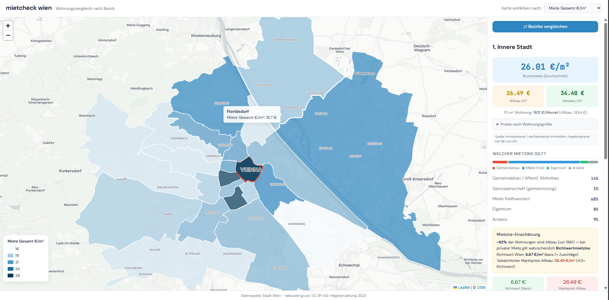

# 🏠 mietcheck wien

**Interaktiver Mietkosten-Vergleichsrechner für Wien** – Bezirke vergleichen, Mietpreise erkunden, Wohnungsstruktur verstehen.

🔗 **[Live-Demo → mietcheck-wien.vercel.app](https://mietcheck-wien.vercel.app)**



---

## Was ist mietcheck wien?

mietcheck wien visualisiert Wohn- und Mietdaten aller 23 Wiener Bezirke auf einer interaktiven Karte. Das Tool richtet sich an Wohnungssuchende, die Bezirke vergleichen möchten, und an alle, die sich für den Wiener Wohnungsmarkt interessieren.

### Features

- **Interaktive Choropleth-Karte** – Bezirke einfärben nach Mietpreis (Gesamt/Altbau/Neubau), Einwohnerdichte, Öffi-Score, Altbau-Anteil u.v.m.
- **Bezirksdetails** – Klick auf einen Bezirk zeigt Mietpreis, Bevölkerung, Wohnungsstruktur, Öffi-Anbindung
- **Mietpreise** – Aktuelle Bruttomieten pro m² mit Altbau/Neubau-Aufschlüsselung und Größenkategorien (immopreise.at)
- **Mietzins-Info** – Welcher Mietzins gilt? Wohnsitztyp-Verteilung, Richtwert vs. Marktpreis, Mietzinsarten erklärt
- **Bezirksvergleich** – Zwei Bezirke side-by-side vergleichen
- **Öffi-Score** – Berechnet aus der Haltestellendichte pro km² (Wiener Linien Daten)
- **Responsive Design** – Optimiert für Desktop und Mobile
- **REST API** – FastAPI Backend mit Filter, Sortierung und automatischem Daten-Refresh

---

## Tech-Stack

| Bereich | Technologie |
|---------|-------------|
| Frontend | React, TypeScript, Vite |
| Karte | Leaflet.js, OpenStreetMap |
| Styling | Tailwind CSS, DM Sans |
| Backend | Python, FastAPI |
| Daten | Open Government Data Wien (CC BY 4.0) |
| Deployment | Vercel (Frontend) |

---

## Datenquellen

Alle Daten stammen aus öffentlichen, frei zugänglichen Quellen:

| Quelle | Inhalt | Lizenz |
|--------|--------|--------|
| [Bezirksgrenzen Wien](https://www.data.gv.at/katalog/dataset/stadt-wien_bezirksgrenzenwien) | GeoJSON der 23 Bezirke | CC BY 4.0 |
| [Registerzählung 2023](https://www.wien.gv.at/data/ogd/ma23/vie-405-2023.csv) | Wohnungen, Bevölkerung, Bauperioden pro Zählbezirk | CC BY 4.0 |
| [Gebäudeinformation Wien](https://www.data.gv.at/katalog/de/dataset/gebaeudeinformation-wien) | 58.000+ Gebäude mit Baujahr und Standort | CC BY 4.0 |
| [Wiener Linien Haltestellen](https://www.data.gv.at/katalog/dataset/stadt-wien_wiaboreitungwienerlinieneaboreitungdatendrehscheibe) | 1.800+ Haltestellen mit Koordinaten | CC BY 4.0 |
| [immopreise.at / derStandard.at](https://www.immopreise.at/Wien/Wohnung/Miete) | Bruttomieten pro Bezirk – Gesamt, Altbau, Neubau mit Größenkategorien (März/Juli 2025) | Presseaussendung |
| [MA 23 – Bezirke in Zahlen 2024](https://www.wien.gv.at/statistik/bezirksdaten) | Bevölkerung nach Wohnsitztyp pro Bezirk (Gemeindebau, Genossenschaft, freie Miete, Eigentum) | CC BY 4.0 |

Datenquelle: Stadt Wien – data.wien.gv.at

---

## Lokale Installation

### Voraussetzungen

- Node.js 22+
- Python 3.11+

### Setup (ein Befehl)
```bash
git clone https://github.com/MilutinK/mietcheck-wien.git
cd mietcheck-wien
python setup.py
```

### Frontend starten
```bash
cd frontend
npm install
npm run dev
```

→ Öffnet auf http://localhost:5173

### Backend starten (optional)
```bash
cd backend
pip install -r requirements.txt
uvicorn app.main:app --reload
```

→ API auf http://localhost:8000

---

## API Endpoints

| Methode | Endpoint | Beschreibung |
|---------|----------|-------------|
| GET | `/api/districts` | Alle Bezirke (mit Sortierung & Filter) |
| GET | `/api/districts/{id}` | Einzelner Bezirk (1–23) |
| GET | `/api/compare?a=X&b=Y` | Vergleich zweier Bezirke |
| GET | `/api/health` | Status & Datenstand |
| POST | `/api/refresh` | Daten neu laden (API-Key erforderlich) |

### Beispiele

```bash
# Alle Bezirke, sortiert nach Mietpreis (teuerste zuerst)
curl "http://localhost:8000/api/districts?sort_by=bruttomiete_m2&sort_order=desc"

# Nur Bezirke mit Miete zwischen 18 und 22 €/m²
curl "http://localhost:8000/api/districts?min_miete=18&max_miete=22"

# Margareten vs. Donaustadt
curl "http://localhost:8000/api/compare?a=5&b=22"
```

---

## Projektstruktur

```
mietcheck-wien/
├── frontend/                  # React + TypeScript + Vite
│   ├── src/
│   │   ├── components/        # ViennaMap, DistrictPanel, CompareView, ...
│   │   ├── services/          # API Service mit Fallback
│   │   ├── types/             # TypeScript Interfaces
│   │   └── utils/             # Farbskala, Hilfsfunktionen
│   └── public/data/           # Statische JSON-Dateien
├── backend/
│   ├── app/
│   │   └── main.py            # FastAPI REST API
│   └── scripts/
│       ├── download_data.py   # Daten von OGD Wien laden
│       ├── etl.py             # ETL Pipeline: Rohdaten → districts.json
│       └── explore_data.py    # Datenanalyse & Validierung
├── data/
│   ├── raw/                   # Rohdaten (nicht im Repo)
│   └── processed/             # Aufbereitete Daten
└── docs/                      # Screenshots & Dokumentation
```

---

## Datenverarbeitung (ETL)

Die ETL-Pipeline aggregiert Daten aus mehreren Quellen zu einer strukturierten `districts.json`:

1. **Bezirksgrenzen** laden (GeoJSON für Karte + Point-in-Polygon)
2. **Registerzählung** aggregieren (250 Zählbezirke → 23 Bezirke)
3. **Gebäude** pro Bezirk zählen (direkte Zuordnung über BEZ-Spalte + Baujahr-Statistik)
4. **Haltestellen** pro Bezirk zuordnen (WKT-Point Parsing + Point-in-Polygon → Öffi-Score)
5. **Mietpreise** aus immopreise.at/derStandard.at manuell ergänzt (Gesamt/Altbau/Neubau)
6. **Wohnsitztyp** aus MA 23 Bezirke in Zahlen 2024 manuell ergänzt

---

## Lizenz

MIT License – siehe [LICENSE](LICENSE)

Die verwendeten Daten stehen unter [CC BY 4.0](https://creativecommons.org/licenses/by/4.0/) – Datenquelle: Stadt Wien – data.wien.gv.at
