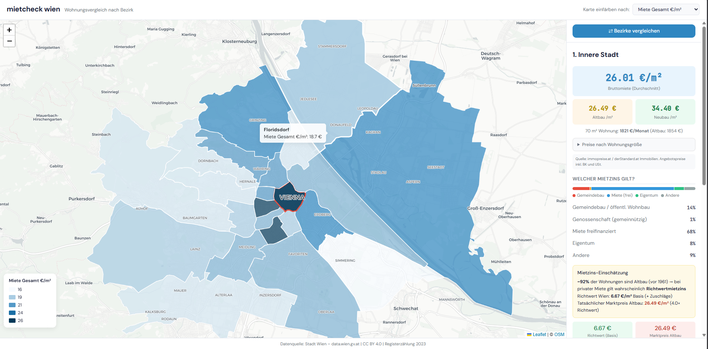

# 🏠 mietcheck wien

**Interaktiver Mietkosten-Vergleichsrechner für Wien** – Bezirke vergleichen, Mietpreise erkunden, Wohnungsstruktur verstehen.

🔗 **[Live-Demo → mietcheck-wien.vercel.app](https://mietcheck-wien.vercel.app)**



---

## Was ist mietcheck wien?

mietcheck wien visualisiert Wohn- und Mietdaten aller 23 Wiener Bezirke auf einer interaktiven Karte. Das Tool richtet sich an Wohnungssuchende, die Bezirke vergleichen möchten, und an alle, die sich für den Wiener Wohnungsmarkt interessieren.

### Features

- **Interaktive Choropleth-Karte** – Bezirke einfärben nach Mietpreis (Gesamt/Altbau/Neubau), Einwohnerdichte, Öffi-Score, Altbau-Anteil u.v.m. Mietpreise laufen von Türkis (günstig) bis Tomatenrot (teuer); die Basiskarte (OpenFreeMap Positron) zeigt beim Zoomen Straßen und Beschriftungen
- **Bezirksdetails** – Klick auf einen Bezirk zeigt Mietpreis, Bevölkerung, Wohnungsstruktur, Öffi-Anbindung
- **Gemeindebau-Ebene** – Alle ca. 1.780 Gemeindebau-Anlagen als zuschaltbare Punkte auf der Karte (Größe = Wohnungszahl), im Bezirkspanel Anlagen und Wohnungen pro Bezirk
- **Standort-Check** – Punkt auf der Karte wählen und sehen, was im Umkreis (300/500/800 m) liegt: Öffi, Parks, Spielplätze, Kindergärten, Schulen, Hausärzte, Apotheken, Märkte und Gemeindebauten, jeweils eingeordnet gegenüber allen Wiener Lagen; die Orte lassen sich einzeln auf der Karte zeigen; der Standort ist per Link teilbar (`?standort=48.2,16.37&r=500`)
- **Bezirk teilen** – `?bezirk=7` in der URL öffnet direkt den Bezirk; der Button „Bezirk teilen“ kopiert den Link
- **Ranking** – Alle 23 Bezirke als Balkenliste, nach Mietpreis oder jeder anderen Kennzahl sortierbar
- **Mietrechner** – „Miete prüfen“ (ist meine Miete zu hoch?) und „Leistbarkeit“ (30-%-Budget, Gemeindewohnung-Einkommensgrenzen 2026, passende Bezirke)
- **Mietpreise** – Aktuelle Bruttomieten pro m² mit Altbau/Neubau-Aufschlüsselung und Größenkategorien (immopreise.at)
- **Mietzins-Info** – Welcher Mietzins gilt? Wohnsitztyp-Verteilung, Richtwert vs. Marktpreis, Mietzinsarten erklärt
- **Bezirksvergleich** – Zwei Bezirke side-by-side vergleichen
- **Öffi-Score** – Berechnet aus der Haltestellendichte pro km² (Wiener Linien Daten)
- **Responsive Design** – Optimiert für Desktop und Mobile
- **REST API** – FastAPI Backend (Railway) mit Filter, Sortierung und Daten-Refresh; das Frontend fällt bei Ausfall auf statische JSON-Dateien zurück

---

## Tech-Stack

| Bereich | Technologie |
|---------|-------------|
| Frontend | React, TypeScript, Vite |
| Karte | Leaflet, MapLibre GL (OpenFreeMap Positron, kein API-Key) |
| Styling | CSS-Variablen, Bricolage Grotesque, Instrument Sans, JetBrains Mono |
| Backend | Python, FastAPI |
| Daten | Open Government Data Wien (CC BY 4.0) |
| Deployment | Vercel (Frontend), Railway (Backend, Docker) |

---

## Datenquellen

Alle Daten stammen aus öffentlichen, frei zugänglichen Quellen:

| Quelle | Inhalt | Lizenz |
|--------|--------|--------|
| [Bezirksgrenzen Wien](https://www.data.gv.at/katalog/dataset/stadt-wien_bezirksgrenzenwien) | GeoJSON der 23 Bezirke | CC BY 4.0 |
| [Registerzählung 2023](https://www.wien.gv.at/data/ogd/ma23/vie-405-2023.csv) | Wohnungen, Bevölkerung, Bauperioden pro Zählbezirk | CC BY 4.0 |
| [Gebäudeinformation Wien](https://www.data.gv.at/katalog/de/dataset/gebaeudeinformation-wien) | 58.000+ Gebäude mit Baujahr und Standort | CC BY 4.0 |
| [Wiener Linien Haltestellen](https://www.data.gv.at/katalog/dataset/stadt-wien_wiaboreitungwienerlinieneaboreitungdatendrehscheibe) | 1.800+ Haltestellen mit Koordinaten | CC BY 4.0 |
| [immopreise.at / derStandard.at](https://www.immopreise.at/Wien/Wohnung/Miete) | Bruttomieten pro Bezirk – Gesamt, Altbau, Neubau mit Größenkategorien (September 2026) | Presseaussendung |
| [Gemeindebau Standorte Wien](https://www.data.gv.at/katalog/dataset/stadt-wien_gemeindebaustandortewien) | Standorte, Wohnungszahl und Baujahr der Gemeindebau-Anlagen (aufbereitet mit `backend/scripts/etl_gemeindebau.py`; die Haltestellen für den Standort-Check mit `etl_haltestellen.py`) | siehe Datensatzseite |
| [Standorte Stadt Wien](https://www.data.gv.at/) | Parkanlagen, Spielplätze, Schulen, Kindergärten, Ärzte (nur Fachrichtung), Apotheken, Märkte für den Standort-Check (aufbereitet mit `backend/scripts/etl_standorte.py`) | siehe jeweilige Datensatzseite |
| [MA 23 – Bezirke in Zahlen 2024](https://www.wien.gv.at/statistik/bezirksdaten) | Bevölkerung nach Wohnsitztyp pro Bezirk (Gemeindebau, Genossenschaft, freie Miete, Eigentum) | CC BY 4.0 |

Datenquelle: Stadt Wien – data.wien.gv.at

---

## Lokale Installation

### Voraussetzungen

- Node.js 22+
- Python 3.11+

### Setup (ein Befehl)
```bash
git clone https://github.com/MilutinK/mietcheck-wien.git
cd mietcheck-wien
python setup.py
```

### Frontend starten
```bash
cd frontend
npm install
npm run dev
```

→ Öffnet auf http://localhost:5173

`npm run dev` und `npm run build` kopieren vorher den MapLibre-Worker nach `public/maplibre` (`scripts/copy-maplibre-worker.mjs`); ohne ihn bleibt die Basiskarte leer.
Optional: `VITE_API_URL` (z. B. in `.env.development`) auf das Backend zeigen lassen.

### Backend starten (optional)
```bash
cd backend
pip install -r requirements.txt
uvicorn app.main:app --reload
```

→ API auf http://localhost:8000

Deployment (Railway, Docker vom Repo-Root): siehe [backend/README.md](backend/README.md).

---

## API Endpoints

| Methode | Endpoint | Beschreibung |
|---------|----------|-------------|
| GET | `/api/districts` | Alle Bezirke (mit Sortierung & Filter) |
| GET | `/api/districts/{id}` | Einzelner Bezirk (1–23) |
| GET | `/api/compare?a=X&b=Y` | Vergleich zweier Bezirke |
| GET | `/api/health` | Status & Datenstand |
| POST | `/api/refresh` | Daten neu laden (API-Key erforderlich) |

### Beispiele

```bash
# Alle Bezirke, sortiert nach Mietpreis (teuerste zuerst)
curl "http://localhost:8000/api/districts?sort_by=bruttomiete_m2&sort_order=desc"

# Nur Bezirke mit Miete zwischen 18 und 22 €/m²
curl "http://localhost:8000/api/districts?min_miete=18&max_miete=22"

# Margareten vs. Donaustadt
curl "http://localhost:8000/api/compare?a=5&b=22"
```

---

## Projektstruktur

```
mietcheck-wien/
├── frontend/                  # React + TypeScript + Vite
│   ├── src/
│   │   ├── components/        # ViennaMap, DistrictPanel, CompareView, RankingView,
│   │   │                      # RentCheckView, AffordabilityView, ...
│   │   ├── services/          # API Service mit Fallback
│   │   ├── types/             # TypeScript Interfaces
│   │   └── utils/             # Farbskala, Hilfsfunktionen
│   ├── scripts/               # copy-maplibre-worker.mjs
│   └── public/data/           # Statische JSON-Dateien
├── backend/
│   ├── app/
│   │   └── main.py            # FastAPI REST API
│   └── scripts/
│       ├── download_data.py   # Daten von OGD Wien laden
│       ├── etl.py             # ETL Pipeline: Rohdaten → districts.json
│       └── explore_data.py    # Datenanalyse & Validierung
├── Dockerfile                 # Backend-Image (Railway)
├── railway.json
├── data/
│   ├── raw/                   # Rohdaten (nicht im Repo)
│   └── processed/             # Aufbereitete Daten
└── docs/                      # Screenshots & Dokumentation
```

---

## Datenverarbeitung (ETL)

Die ETL-Pipeline aggregiert Daten aus mehreren Quellen zu einer strukturierten `districts.json`:

1. **Bezirksgrenzen** laden (GeoJSON für Karte + Point-in-Polygon)
2. **Registerzählung** aggregieren (250 Zählbezirke → 23 Bezirke)
3. **Gebäude** pro Bezirk zählen (direkte Zuordnung über BEZ-Spalte + Baujahr-Statistik)
4. **Haltestellen** pro Bezirk zuordnen (WKT-Point Parsing + Point-in-Polygon → Öffi-Score)
5. **Mietpreise** aus den immopreise.at-PDFs (derStandard.at, Stand September 2026) manuell übernommen (Gesamt/Altbau/Neubau)
6. **Wohnsitztyp** aus MA 23 Bezirke in Zahlen 2024 manuell ergänzt

---

## Lizenz

MIT License – siehe [LICENSE](LICENSE)

Die verwendeten Daten stehen unter [CC BY 4.0](https://creativecommons.org/licenses/by/4.0/) – Datenquelle: Stadt Wien – data.wien.gv.at
